[comment]: <> (please keep all comment items at the top of the markdown file)
[comment]: <> (please do not change the ***, as well as 
 placeholders for Note and Tip layout)
[comment]: <> (please keep the ### 1. and 2. titles as is for consistency across all demoguides)
[comment]: <> (section 1 provides a bullet list of resources + clarifying screenshots of the key resources details)
[comment]: <> (section 2 provides summarized step-by-step instructions on what to demo)

[comment]: <> (this is the section for the Note: item; please do not make any changes here)
***
### Azure Functions - Blob Trigger which adds a Watermark to images uploaded to Blob Storage - demo scenario

**Note:** Below demo steps should be used **as a guideline** for doing your own demos. Please consider contributing to add additional demo steps.

[comment]: <> (this is the section for the Tip: item; consider adding a Tip, or remove the section between 
 and 
 if there is no tip)

**Tip:** While the main use case of this scenario is Azure Functions, it could also be used to demonstrate Azure Storage Accounts Blob, Blob Data Contributor RBAC Permissions, as well as Application Insights.

**Demo scenario story:** Using this demo scenario, you showcase a solution for processing images uploaded to an /input blob container, which in turn triggers an Azure Function for each uploaded file. The Azure Function adds a red watermark text to the image, and stores the new image file in an /output blob container using the same file name as the original.  Each aspect of the architecture provides live dashboard views, allows for showing the Azure Functions base monitoring capabilities, as well as more detailed information can be viewed real-time from Azure Application Insights.

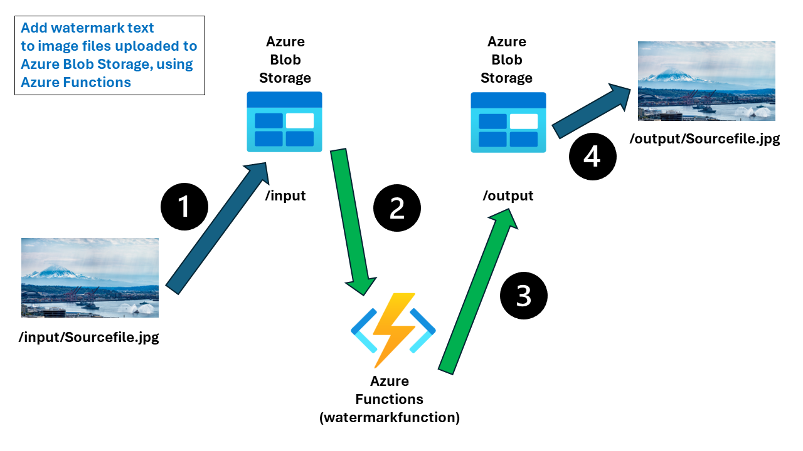
  

***
### 1. What Resources are getting deployed
This scenario deploys the sample **WatermarkFunction** application architecture, which relies on the following Azure resources all working together: 

* MTTDemoDeployRGc%youralias%WATERMARK - Azure Resource Group.
* %youralias%wmarkstoraccnt - Azure Storage Account with blob containers /input and /output, used for uploading and storing images
* %youralias%wmarkfunctions - Azure Functions with Blob Trigger
* %youralias%tbappinsights - Application Insights, primarily showing Live Metrics of the Functions API calls

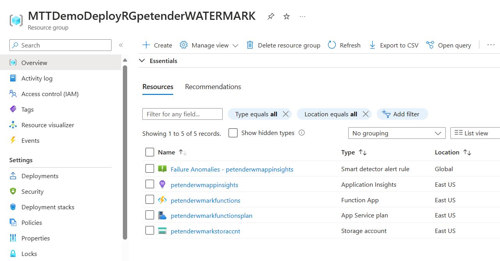
  

### 2. What can I demo from this scenario after deployment

#### Azure Storage Account

1. Navigate to the **Input** Container; this container is initially empty. 

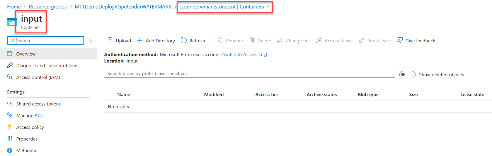
  

1. Upload any **image file** (jpg, jpeg, png) from your local machine to the Input blob container. 

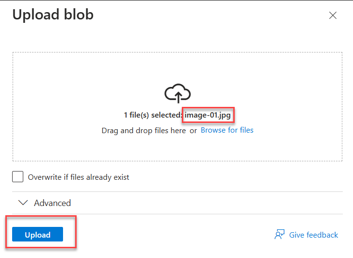
  

1. This triggers the WatermarkFunction you will demo in a later stage. 

1. Wait about a minute, and navigate to the Output blob container.

1. Notice a new image file - using the same filename as the original - is created. 

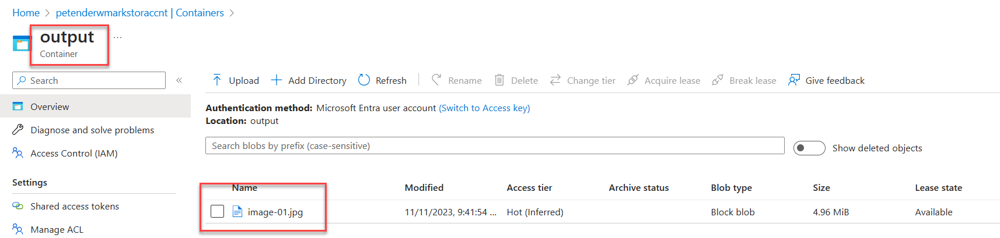
  

1. **Select** the created image, and click **Download** to download and **Open** the image file. Notice how this image has **watermark text in red** added to it.

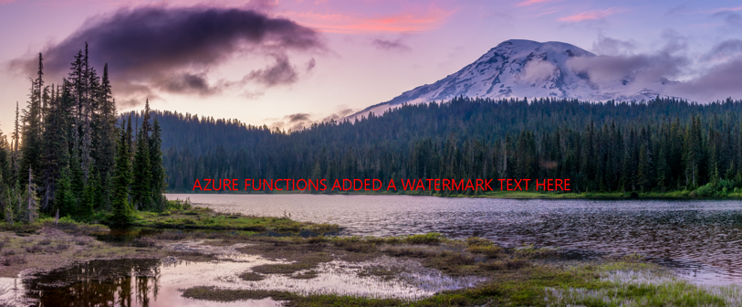
  

**Tip:** If you have more image files available, feel free to upload multiple files at once. Each uploaded file will generate a new output image file. 

#### Azure Functions

1. From the Azure Portal, navigate to **Azure Functions**. Open the **%youralias%wmarkfunctions** Function App.

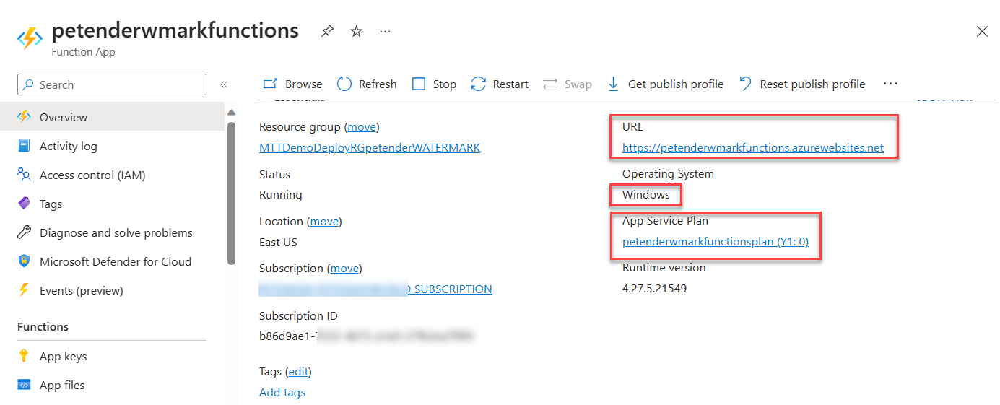
  

1. From **Overview**, navigate to **Functions** and open the **AddWatermarkToImage** Function itself.

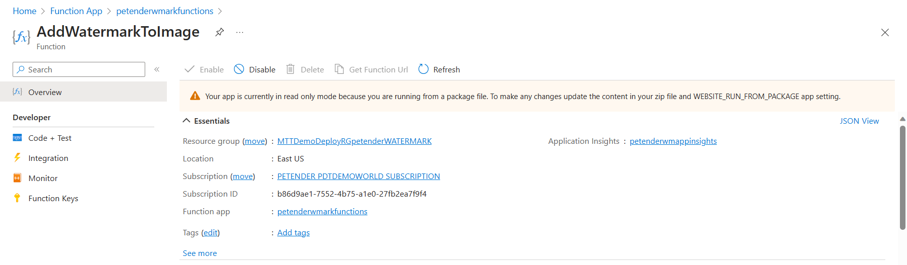
  

1. **Ignore** the warning stating the Function is in read-only mode. This is because it got deployed using automation (DevOps). 

1. Navigate to **Code + test**. This opens the **functions.json** bindings file. 

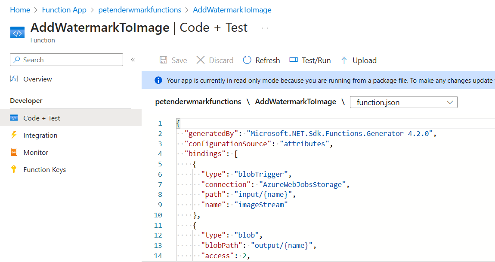
  

1. One of the most powerful features of triggers and bindings is binding expressions. In the function.json file and in function parameters and code, you can use expressions that resolve to values from various sources.

Most expressions are identified by wrapping them in curly braces. For example, in this blob trigger function, input/{name} resolves the storage account container and uploaded image file name. Similarly, the blobpath output/{name} identifies the file name and container location to use to storage the newly produced image file. 

1. Next, select **Monitor**. If you already uploaded image(s), the **Invocation** will show the corresponding number of uploads.

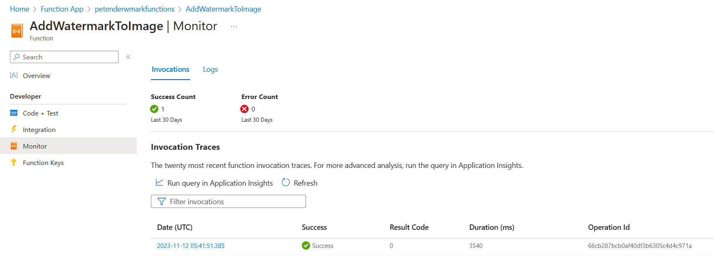
  

1. From **Invocation Traces**, select an item by clicking the **Date** field. This opens the **Invocation Details** blade, showing more information about each step in the Azure Function Blob Trigger process.

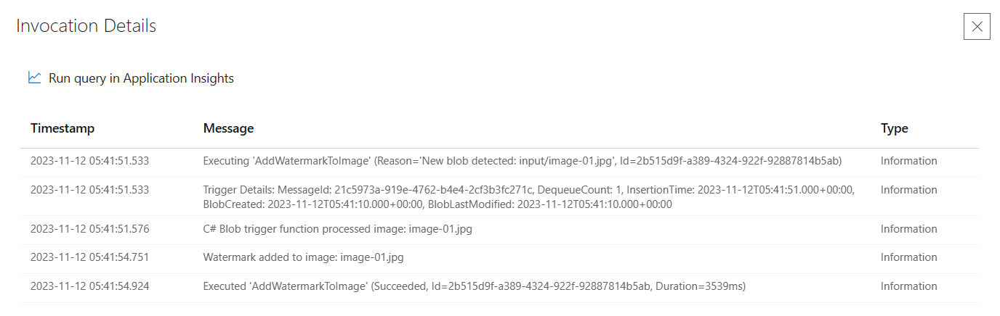
  

1. From the **Function App** Blade, navigate to **Configuration**. This shows more details about the Application Variables and Settings. Explain to the learner these settings are typically stored in **appsettings.json**, but now moved out of the source code of the application. (Note: you should highlight it would be a security recommendation to store these values in **Azure Key Vault**).

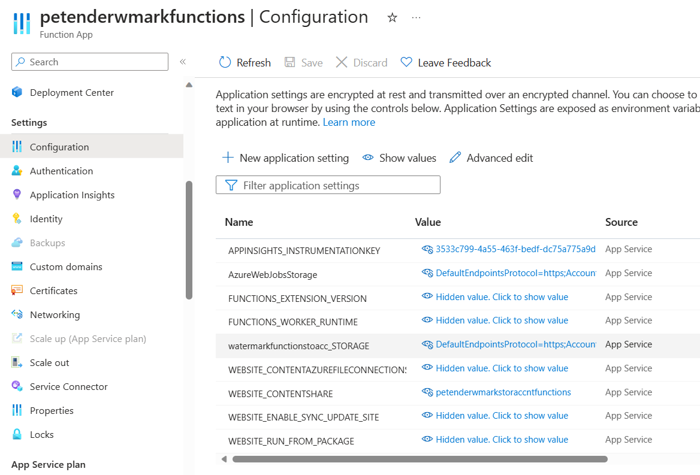
  

1. Select the **WEBSITE_RUN_FROM_PACKAGE** Setting, which refers to the fact that the actual Function code got published through an automation / DevOps pipeline or Development Environment (such as Visual Studio or VSCode or similar) publishing process, instead of entered into the Azure Portal itself.

#### Application Insights

1. Navigate to Application Insights, opening the **%youralias%wmappinsights** resource. Go to **Live Metrics**. This will show a lot of different views about the ongoing processing of Functions, Events, Storage activity and more. 

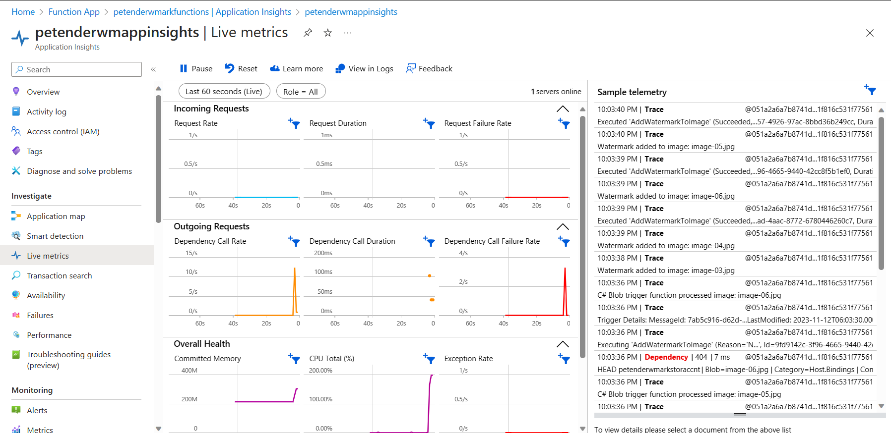
  

Note: If you see the "Demo" page, it means you don't have live metrics (anymore), and the processing of the images is completed already. To generate (new) live data, go back to the /input container, and upload one or more images to trigger the Azure Function.

1. Zoom in on the **sample telemetry** to the right hand side. Explain how the different API-streams of the application topology are visible here. Notice how it shows the Azure Function call "AddWatermarkToImage", as well as interaction with "Azure Storage Account", etc...

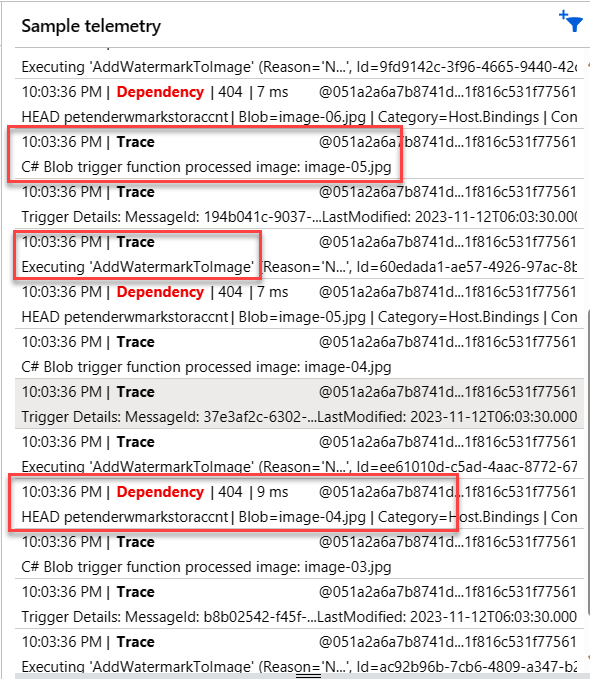
  

1. Depending when you opened the Live Metrics view, the sample telemetry should have a **red** item **Dependency**, which simulates an issue from the Azure Function to Azure Storage, showing you the details of the **API POST Action call**.

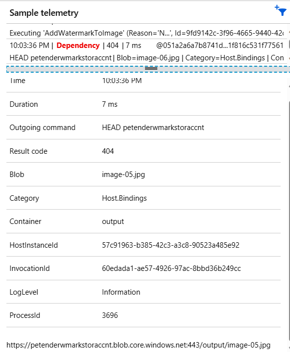
  

1. Next, select **Application Map** within Application Insights. 

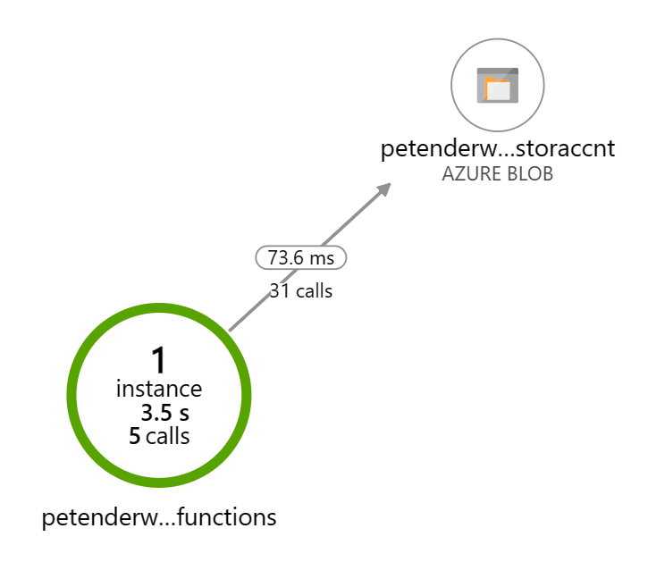
  

1. Explain the usage of Application Map, describing the 2 different views here. The first view **%youralias%wmfunctions**, shows the number of running (Azure Functions) instances, with different metrics (performance details). The Events are representing communication with Azure Blob Storage. It shows the **number of blob storage calls**, as well as the **average performance** between the Blob Trigger Functions and Storage Account Blob. 

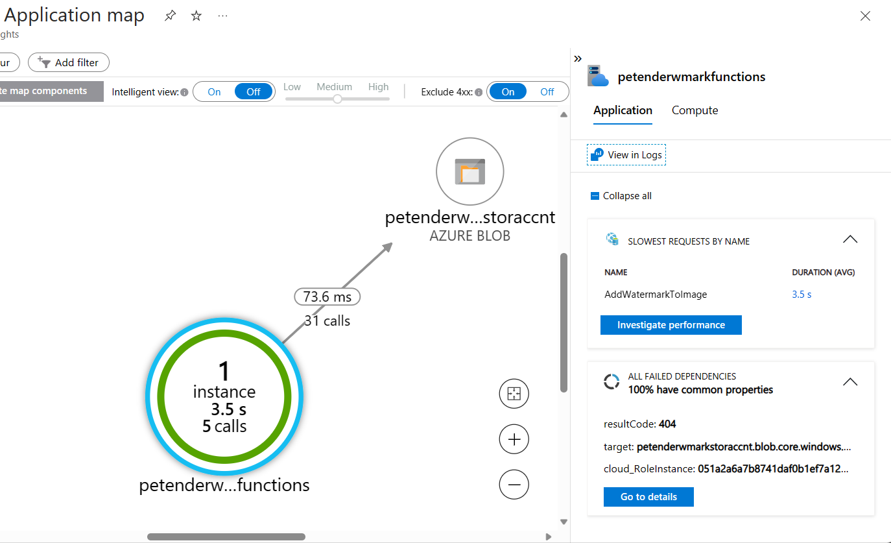
  

1. Select the **value** metric in the middle between Functions and Storage Account, to open the more detailed view. This opens a blade to the right-hand side of the Azure Portal, exposing many more details about the processing of events. It shows details about the CosmosDB instance, as well as performance details of each CosmosDB action (GET, Create Document, Get Collection, etc...)

1. Click on **Investigate Performance**

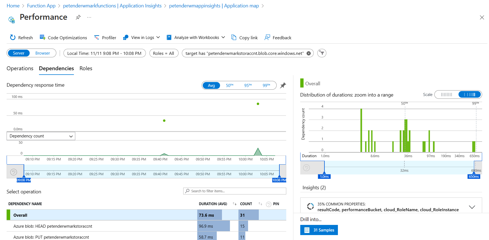
  

1. Use this detailed dashboard to explain the different sections, reflecting chart representations of actual **Log Analytics Queries**. This can be demoed by selecting **View Logs** from the top menu, selecting the **Performance Histogram** section, and opening it in Log Analytics.

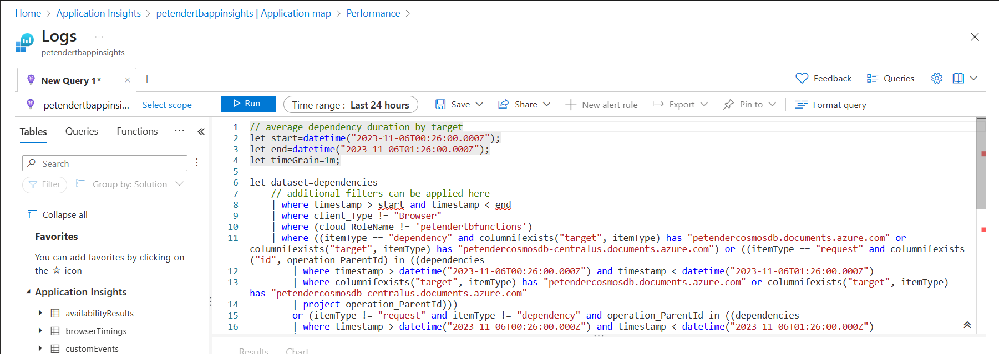
  

[comment]: <> (this is the closing section of the demo steps. Please do not change anything here to keep the layout consistant with the other demoguides.)
  
***

**Note:** This is the end of the current demo guide instructions.

